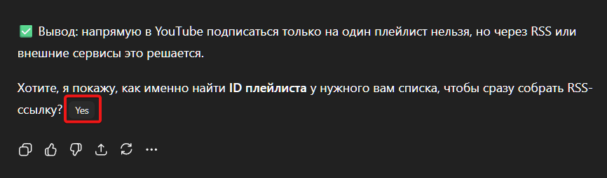

# Userscripts

> Generated by `npm run generate`.

## Bladificator 0.1

try to take over the world!

- **File:** [`src/userscripts/telegram-bladificator.userscript.js`](../../src/userscripts/telegram-bladificator.userscript.js)
- **RAW** [telegram-bladificator.userscript.js](https://raw.githubusercontent.com/popstas/userscripts/refs/heads/master/src/userscripts/telegram-bladificator.userscript.js)
- **Matches:** `https://web.telegram.org/*`
- **Grants:** `GM_addStyle`

**Demo:**
—

## ChatGPT: Append last assistant question to prompt (init + SPA) 1.2.0

Находит последний 
 с вопросом в сообщениях ассистента и добавляет кнопки Yes / Yes N (если есть «или»); обрабатывает уже существующие и новые сообщения

- **File:** [`src/userscripts/chatgpt-question-buttons.userscript.js`](../../src/userscripts/chatgpt-question-buttons.userscript.js)
- **RAW** [chatgpt-question-buttons.userscript.js](https://raw.githubusercontent.com/popstas/userscripts/refs/heads/master/src/userscripts/chatgpt-question-buttons.userscript.js)
- **Matches:** `https://chatgpt.com/*`
- **Grants:** `none`

**Demo:**

## codex-helper 1.6.0

Следит за появлением/исчезновением .loading-shimmer-pure-text ИЛИ svg>circle в .task-row-container. Пишет статусы на холсте и (опционально) озвучивает. Игнорирует задачи без имени ("Unnamed task"). Не объявляет "Task complete", если ранее было "Completing the task". Считает "Completing" также по прогрессу в .text-token-text-tertiary вида N/N (2/2, 3/3 и т.п.).

- **File:** [`src/userscripts/codex-helper.userscript.js`](../../src/userscripts/codex-helper.userscript.js)
- **RAW** [codex-helper.userscript.js](https://raw.githubusercontent.com/popstas/userscripts/refs/heads/master/src/userscripts/codex-helper.userscript.js)
- **Matches:** `https://chatgpt.com/codex*`
- **Grants:** `none`

**Demo:**
—

## Whatsapp fix 0.1

—

- **File:** [`src/userscripts/whatsapp-fix.userscript.js`](../../src/userscripts/whatsapp-fix.userscript.js)
- **RAW** [whatsapp-fix.userscript.js](https://raw.githubusercontent.com/popstas/userscripts/refs/heads/master/src/userscripts/whatsapp-fix.userscript.js)
- **Matches:** `https://web.whatsapp.com/*`
- **Grants:** `GM_xmlhttpRequest`, `GM_getResourceText`, `GM_addStyle`

**Demo:**
—

